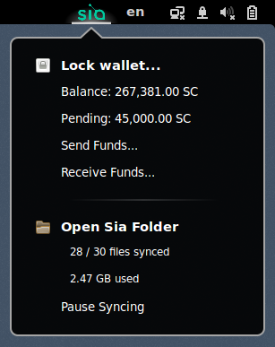

##Sia Cloud Storage Extension for GNOME Shell - BETA VERSION

The Sia Cloud Storage extension integrates Sia directly into your GNOME desktop. The extension automatically synchronizes files in a local folder (`~/Sia`) with the Sia cloud. Files are re-uploaded when they expire or file-sizes change. The extension automatically starts the Sia daemon when possible.

###What is Sia?
Sia is a blockchain-based decentralized cloud storage platform that allows users all over the world to contribute available storage space from their computers to form a decentralized network. Using Sia, you can rent storage from hosts on the network. This is accomplished via "smart" storage contracts stored on the Sia blockchain. Hosts are paid for storing files, oce the host has kept a file for an agreed amount of time.

Siacoins is the Sia network’s own currency, and is used to fund storage contracts. You can earn Siacoins by sharing unused storage space on your computer, or you can buy Siacoin on an exchange.

   

###Features
* Recursive synchronization of local folder (`~/Sia`)
* File versioning
* Unlock/lock wallet
* View Siacoin balance and pending transfers
* Send Siacoins
* Create address to receive funds
* Auto-start Sia daemon (requires `siad` to be found in path)
* Sync and upload statistics

###Install
Install the extension by downloading all files into `~/.local/share/gnome-shell/extensions/sia@pmknutsen.github.com`, and then restart the GNOME shell with `Alt+F2` and `r`.

```
# Clone the Git repository
git clone https://github.com/pmknutsen/gnome-shell-sia ~/.local/share/gnome-shell/extensions/sia@pmknutsen.github.com
```

###Versioning
Files that change locally are re-uploaded to the Sia cloud. The old versions of changed files are downloaded as hidden `.sia`
files into the local sync folder, and then removed from the Sia renter. Thus, old versions are no longer available through
the graphical wallet, but can be restored using the hidden `.sia` files. The version of the file in the renter is therefore
always the latest version. Note that users you have shared your file with cannot access the latest version, unless you re-share
the new Sia sharing code with them. They can, however, continue to access the old version you shared with them until the file
storage contract of that version expires.

###Troubleshooting
**"My files are not uploaded to the cloud"**

Your wallet needs to be unlocked and funded in order for Sia to form new storage contracts with hosts. Restrictive firewalls may also prevent Sia from connecting to the cloud. If that is not the case and synchronization has indeed halted, try restarting the Sia daemon (`siac stop`).

**"What are Siacoins and how to get them?"**

Siacoins is the Sia network’s own currency, and is used to fund storage contracts. You can earn Siacoins by sharing unused storage space on your computer, or you can buy Siacoins with bitcoins on an exchange, such as [Poloniex](http://poloniex.com). You can also request a small amount of free Siacoins from the faucet at [SiaPulse.com](http://siapulse.com/page/faucet).

**"Sia does not automatically start"**

To enable auto-start of the Sia daemon, the program `siad` needs to be in your path. Create a symbolic link to siad:
`sudo ln -s /path/to/siad /usr/bin/siad`

**"The extension does not run"**

The extension may not be compatible with your version of GNOME. Please file an issue with details of your distribution and GNOME version and support may be added at a later time.

**"Where are old versions of my files?"**

See **Versioning**.

###License
**The MIT License (MIT)**

*Copyright (c) 2016 Per Knutsen*

Permission is hereby granted, free of charge, to any person obtaining a copy of this software and associated documentation files (the "Software"), to deal in the Software without restriction, including without limitation the rights to use, copy, modify, merge, publish, distribute, sublicense, and/or sell copies of the Software, and to permit persons to whom the Software is furnished to do so, subject to the following conditions:

The above copyright notice and this permission notice shall be included in all copies or substantial portions of the Software.

THE SOFTWARE IS PROVIDED "AS IS", WITHOUT WARRANTY OF ANY KIND, EXPRESS OR IMPLIED, INCLUDING BUT NOT LIMITED TO THE WARRANTIES OF MERCHANTABILITY, FITNESS FOR A PARTICULAR PURPOSE AND NONINFRINGEMENT. IN NO EVENT SHALL THE AUTHORS OR COPYRIGHT HOLDERS BE LIABLE FOR ANY CLAIM, DAMAGES OR OTHER LIABILITY, WHETHER IN AN ACTION OF CONTRACT, TORT OR OTHERWISE, ARISING FROM, OUT OF OR IN CONNECTION WITH THE SOFTWARE OR THE USE OR OTHER DEALINGS IN THE SOFTWARE.